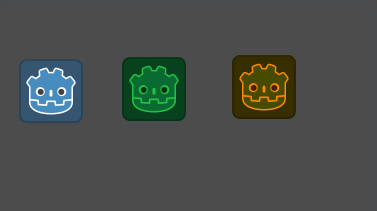
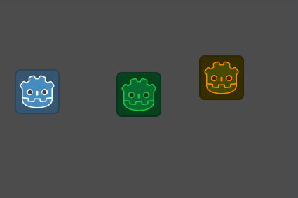
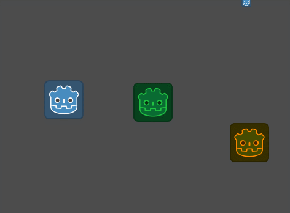
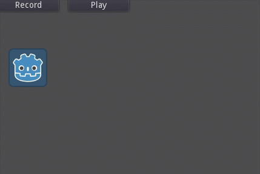

# InputState

To test this locally, proceed to:
https://github.com/godotengine/godot/pull/35240

## Problem

Consider this somewhat typical input handling code that you can see in many tutorials involving character movement:

```gdscript
extends Sprite

var speed = 300.0

func _physics_process(delta):
	if Input.is_action_pressed("ui_left"):
		position += Vector2.LEFT * speed * delta
	if Input.is_action_pressed("ui_right"):
		position += Vector2.RIGHT * speed * delta
	if Input.is_action_pressed("ui_up"):
		position += Vector2.UP * speed * delta
	if Input.is_action_pressed("ui_down"):
		position += Vector2.DOWN * speed * delta
```

While this works perfectly fine for single-character games (like First-person shooters), this approach becomes unusable for type of games involving multiple characters (like real-time strategy games, or simply turn-based games).

Firstly, `Input` singleton is global by definition. If we place multiple characters given the same script, naturally they are going to be controlled by the same input which results in synchronous movement. While this could work for certain type of games, this is probably not what we want for the most part.



Secondly, if a game implements certain characters which can be controlled by an AI, we'll likely want to somehow manipulate the dynamics of a character via code as well, so we also need to copy some of the `Input` internal state to each of the characters in the game and interpret that as input instead (mainly talking about input-driven AI here).

## First steps

Lets improve the situation by adding a new `motion` property to the character:

```gdscript
extends Sprite

var speed = 300.0
export var motion = Vector2()

func _physics_process(delta):
    # First, collect input
	if Input.is_action_pressed("ui_left"):
		motion += Vector2.LEFT
	if Input.is_action_pressed("ui_right"):
		motion += Vector2.RIGHT
	if Input.is_action_pressed("ui_up"):
		motion += Vector2.UP
	if Input.is_action_pressed("ui_down"):
		motion += Vector2.DOWN

    # Finally, process logic given the input
	position += motion * speed * delta
	motion = Vector2()
```

This has two parts now: the part which collects input and the part which acts upon the input, in our case by actually moving the character. This has some nice benefits:

- makes the "input state" (`motion`) more independent from `Input` singleton;
- the property can be modified externally which allows us to possibly implement an AI controller in the future;
- can even be animated!

One of the major downside is that if we do modify the `motion` property directly, it's still vulnerable to user input, so we need something better.

## Filtered input and AI

In a multi-character game, you'll mostly want to control only one or a group of characters out of all available. Lets add `controlled` property:

```gdscript
export var controlled = false

func _physics_process(delta):
	if not controlled:
		return
```

That's simple enough. Recall AI stuff? Lets make up something:

```gdscript
export var motion = Vector2()
export var controlled = false
export var human = false

func _physics_process(delta):
	if not controlled:
		return

	if human:
		if Input.is_action_pressed("ui_left"):
			motion += Vector2.LEFT
		if Input.is_action_pressed("ui_right"):
			motion += Vector2.RIGHT
		if Input.is_action_pressed("ui_up"):
			motion += Vector2.UP
		if Input.is_action_pressed("ui_down"):
			motion += Vector2.DOWN
	else:
		# Brownian AI motion!
		motion += [Vector2.RIGHT, Vector2.LEFT, 
                Vector2.DOWN, Vector2.UP][randi() % 4]

	position += motion * speed * delta
	motion = Vector2()
```



For simplicity, the primitive AI randomly picks 1 out of 4 given directions here and modifies the `motion` property accordingly. But what if we add more type of inputs now?

## Too many actions

What we've done so far is cloning our global `Input` state down to our character instances, controlled by either a human or an AI. Lets add some more type of input actions to see how well this scales:

```gdscript
var motion = Vector2()
var sprint = false
var shoot = false
# ... and
# ... much
# ... more

export var controlled = false
export var human = false

func _physics_process(delta):
	if not controlled:
		return
        
	if human:
		if Input.is_action_pressed("ui_left"):
			motion += Vector2.LEFT
		if Input.is_action_pressed("ui_right"):
			motion += Vector2.RIGHT
		if Input.is_action_pressed("ui_up"):
			motion += Vector2.UP
		if Input.is_action_pressed("ui_down"):
			motion += Vector2.DOWN

		sprint = Input.is_action_pressed("sprint")
		shoot = Input.is_action_just_pressed("shoot")
		# ... and many more!
	else:
		motion += [Vector2.RIGHT, Vector2.LEFT, 
                Vector2.DOWN, Vector2.UP][randi() % 4]
		sprint = true if rand_range(0.0, 1.0) > 0.9 else false
		shoot = true if rand_range(0.0, 1.0) > 0.9 else false
        # ... and many more!

    if sprint:
        position += motion * speed * 2.0 * delta
    else:
        position += motion * speed * delta

	if shoot:
		# shoot bullets here
        pass

	motion = Vector2()
	sprint = false
	shoot = false
    # ... and many more!
```



Imagine if you have more than 3 actions... There's clearly something wrong with this approach.

## Hardcoded input states

Ideally, we need to remove `Input` handling dependency from our character scripts, because we don't want the user input to mess up with AI, recorded, or simulated input. In some way, we basically need to keep a local copy of internal input state representation within each character instance.

Unfortunately, there's no easy way to retrieve the entire input state. The current `Input` API only allows us to scratch the surface of the real input state, here's some example:

```gdscript
func get_pressed_actions():
	var pressed = []

	for action in InputMap.get_actions():
		if Input.is_action_pressed(action):
			pressed.push_back(action)

	return pressed
    
# How about the pressed keys and joypad buttons?..
```

Similarly, you'd have to implement a bunch of other utility methods, and ensure that you keep all the input metadata like action strength, which is a nightmare if done via script, and in most cases this just leads to "one-way" communication.

Because we *do* want to make sure that we don't miss any input along the programming hurdles, there needs to be a more elegant and unified way to handle this problem.

# Introducing `InputState` class

`InputState` is a new type of the `Resource` which decouples input handling logic from the actual input state. The `Input` singleton has a master instance of this class exposed as a property. This means that:

- we can have multiple unique instances of the input state;
- share input states between multiple instances (resources are shared by default);
- switch input states depending on the context;
- have a more low-level control over the internal states not provided nor exposed by the `Input` singleton by default.
- can be serialized, sent over the network, saved to disk etc.

The `InputState` API mostly replicates the `Input` API, but only those methods which are responsible for data queries such as `is_action_pressed()`.

To be more concrete, lets rewrite our previous script using `InputState` class:

```gdscript
export(InputState) var input = InputState.new()
export var controlled = false
export var human = false

func _physics_process(delta):
	if not controlled:
		return

	if human:
		# We have to update our local input state from the global one,
		# in essence requesting a local copy of the state, forwarding it.
		input.feed(Input.state)
	else:
		# This doesn't interfere with the rest of the characters so we can safely
		# modify the state the way we want locally.
		input.release_pressed_events()
		var rand_move = ["ui_left", "ui_right", "ui_up", "ui_down"][randi() % 4]
		input.action_press(rand_move)
		if rand_range(0.0, 1.0) > 0.5:
			input.action_press("sprint")
		if rand_range(0.0, 1.0) > 0.9:
			input.action_press("shoot")

	# Regardless of whether it was a human or an AI,
	# we can use the same API to determine the behavior now.
    
	var motion = Vector2()

	if input.is_action_pressed("ui_left"):
		motion += Vector2.LEFT
	if input.is_action_pressed("ui_right"):
		motion += Vector2.RIGHT
	if input.is_action_pressed("ui_up"):
		motion += Vector2.UP
	if input.is_action_pressed("ui_down"):
		motion += Vector2.DOWN

	if input.is_action_pressed("sprint"):
		position += motion * speed * 2.0 * delta
	else:
		position += motion * speed * delta

	if input.is_action_just_pressed("shoot"):
		pass # shoot bullets here
```

## Benefits
- we cannot possibly pollute the global input state unless we explicitly tell so.
- you can request your local state to be updated from the global input state.
- removes the need to manually copy the internal Input state to each character instance so that there's no need to redefine local variables for each action.
- use your usual Input API locally
- the input state can be shared between instances so that multiple characters can be controlled given the same input
- you can program AI movement by simulating inputs (action presses etc).
- multiple series of input states can be serialized, sent over the network, and be saved to disk.

## Use case: recording input states for playback

Gameplay can be simulated via feeding input events alone, for instance implementing replay system, this can save quite a bunch of memory without having to read the whole game state as events are much more lightweight. State interpolation could be implemented to help this, but in some cases it's just easier to feed those input events as the existing logic can just respond to an input event and you get almost the same behavior without writing some complex logic to replicate those actions on top of the existing logic.

As most engines are not truly deterministic (including Godot), this isn't the perfect solution, but things like:

- instant replay (nice shot, lets see how it went!);
- tutorials (repeat after me!);
- recording combo actions before they can be executed (fighting games);

These could be as well be implemented by simulating inputs as the floating point error would be negligible for short replication episodes for the butterfly effect to kick in, especially if this doesn't affect the gameplay itself.

### Recording input events

The process of recording input events was "relatively easy" process:

```gdscript
func _input(event):
	if event.is_action_type() and not event is InputEventMouseMotion:
		input_player.record_event(event) # queues event to be recorded

func process():
	if mode == Mode.PLAY:
		if track.has(position):
			Input.parse_input_event(track[position])
		position = int(clamp(position + 1, 0, length))

	elif mode == Mode.RECORD:
		if queued_event:
			track[position] = queued_event
			queued_event = null
		position += 1
```
        
The problem with this approach is that it's not always convenient to use `_input` callback, because you can't detect a combination of input events easily. Using this approach has also some caveats if used for networking needs, unlike the `Input` singleton which collects all the parsed input events for us to query.

The only problem currently is that, as previously regurgitated, `Input` internal state is simply unaccessible for those actions to be replicated more or less deterministically.

That's where `InputState` comes into action, as it provides more low-level access to internal data. In fact, the whole state can be retrieved via a single `data` property:

```gdscript
# recorder.gd

var snapshots = [] a collection of Input.state.data

func process():
	if mode == Mode.RECORD:
		# `input` is a local instance of Input.state
		snapshots.push_back(character.input.data)
		playback_pos = clamp(playback_pos + 1, 0, snapshots.size() - 1)
	elif mode == Mode.PLAY:
		character.input.data = snapshots[playback_pos]
```



That's the gist of the process of recording and replaying input-driven game. Unlike `InputEvents`, the data can also be sent over network, saved to disk etc. The question of whether all of the data is actually useful would be determined by game-specific requirements. You can filter and set the data without worrying about missing fields. In most cases, such data can also be efficiently compressed.
